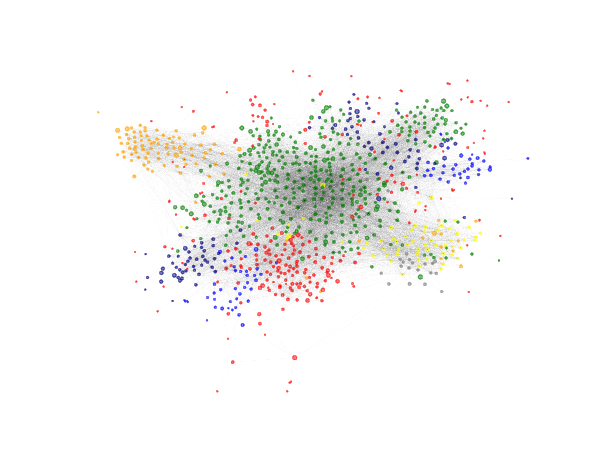

Embedding-based Silhouette Community Detection

> Embeddings are becoming mainstream way for network-based learning.
> Can unsupervised structure be derived from geometry of embeddings?
> SCD is an embedding-agnostic way of community detection.


This is the official repository for the following paper (please, cite if used):
To install the library, please do:

```
pip3 install -r requirements.txt
```

Install PyTorch (GPU or CPU version). And:

```
pip3 install https://github.com/SkBlaz/SCD.git
```

or (within the repo folder)


```
python3 setup.py install
```

The simplest way to detect communities can be summarized in the following snippet:

```python
import SCD
import scipy.io
## load a sparse matrix representation of the network
graph = scipy.io.loadmat("example_networks/example_network.mat")
graph = graph['network']
node_names = list(range(graph.shape[1]))
SCD_detector = SCD.SCD_obj(graph,node_names=node_names) #instantiate

## all hyperparameters
SCD_detector.list_arguments()

## set hyperparameters
param2 = {"verbose":True,"parallel_step":8}
communities = SCD_detector.detect_communities(**param2)
print(communities)
```

Or using NetworkX:

```python
import networkx as nx
graph = nx.barbell_graph(20,10)
sparse_mat = nx.to_scipy_sparse_matrix(graph)
node_names = list(range(sparse_mat.shape[1]))
SCD_detector = SCD.SCD_obj(sparse_mat,node_names=node_names) #instantiate

## all hyperparameters
SCD_detector.list_arguments()

## set hyperparameters
param2 = {"verbose":True,"parallel_step":8}
communities = SCD_detector.detect_communities(**param2)
print(communities)

```


Note that:
1. SCD operates on sparse matrices. If your network is e.g., a networkX object, convert it with *nx.to_sparse_scipy_matrix()* method. Example parser that does that for the user is available in SCD/parsers.py

To check if the performance of the library is OK, one can perform simple tests as follows:

To run the tests, please run:

```python
python3 -m pytest tests/*

```


# Citation
```
@article{vskrlj2019embedding,
  title={Embedding-based Silhouette Community Detection},
  author={{\v{S}}krlj, Bla{\v{z}} and Kralj, Jan and Lavra{\v{c}}, Nada},
  journal={arXiv preprint arXiv:1908.02556},
  year={2019}
}
```