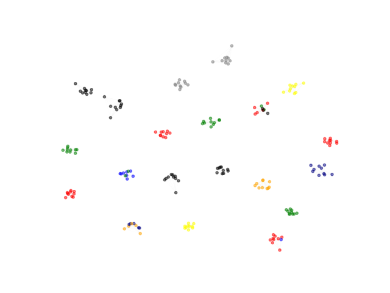

Embedding-based Silhouette Community Detection

> Embeddings are becoming mainstream way for network-based learning.
> Can unsupervised structure be derived from geometry of embeddings?
> SCD is an embedding-agnostic way of community detection.


This is the official repository for the following paper (please, cite if used):
To install the library, please do:

```
pip3 install -r requirements.txt
```

Install PyTorch (GPU or CPU version). And:

```
pip3 install git+https://github.com/skblaz/SCD.git

```

or (within the repo folder)


```
python3 setup.py install
```

The simplest way to detect communities can be summarized in the following snippet:

```python
import SCD
import scipy.io
## load a sparse matrix representation of the network
graph = scipy.io.loadmat("example_networks/example_network.mat")
graph = graph['network']
node_names = list(range(graph.shape[1]))
SCD_detector = SCD.SCD_obj(graph,node_names=node_names,device = "cpu") #instantiate, set to gpu for gpu use.

## all hyperparameters
SCD_detector.list_arguments()

## set hyperparameters
param2 = {"verbose":True,"parallel_step":8,"node_feature_type":"netmf_embedding"} # or ppr_embedding
communities = SCD_detector.detect_communities(**param2)
print(communities)
```

Or using NetworkX:

```python
import networkx as nx
graph = nx.barbell_graph(20,10)
sparse_mat = nx.to_scipy_sparse_matrix(graph)
node_names = list(range(sparse_mat.shape[1]))
SCD_detector = SCD.SCD_obj(sparse_mat,node_names=node_names) #instantiate

## all hyperparameters
SCD_detector.list_arguments()

## set hyperparameters
param2 = {"verbose":True,"parallel_step":8}
communities = SCD_detector.detect_communities(**param2)
print(communities)

```


Note that:
1. SCD operates on sparse matrices. If your network is e.g., a networkX object, convert it with *nx.to_sparse_scipy_matrix()* method. Example parser that does that for the user is available in SCD/parsers.py

To check if the performance of the library is OK, one can perform simple tests as follows:

To run the tests, please run:

```python
python3 -m pytest tests/*

```

Simple community visualization:
```python

from py3plex.visualization.multilayer import *
from py3plex.visualization.colors import colors_default
import SCD
from collections import Counter


import networkx as nx

graph = nx.caveman_graph(20, 10)
print(nx.info(graph))

sparse_mat = nx.to_scipy_sparse_matrix(graph)
node_names = list(range(sparse_mat.shape[1]))
SCD_detector = SCD.SCD_obj(sparse_mat,node_names=node_names) #instantiate

## all hyperparameters
SCD_detector.list_arguments()

## set hyperparameters
param2 = {"verbose":True,"parallel_step":8}
partition = SCD_detector.detect_communities(**param2)

# select top n communities by size
top_n = 20 ## colors will repeat a bit
partition_counts = dict(Counter(partition.values()))
top_n_communities = list(partition_counts.keys())[0:top_n]

# assign node colors
color_mappings = dict(zip(top_n_communities,[x for x in colors_default if x != "black"][0:top_n]))
network_colors = [color_mappings[partition[x]] if partition[x] in top_n_communities else "black" for x in graph.nodes()]

# visualize the network's communities!
hairball_plot(graph,
	      color_list=network_colors,
	      layout_parameters={"iterations": 20},
	      scale_by_size=True,
	      layout_algorithm="force",
	      legend=False)
plt.show()

```





What about some custom embeddings? Simple!

```python
from py3plex.visualization.multilayer import *
from py3plex.visualization.colors import colors_default
import SCD
from collections import Counter
import networkx as nx
from sklearn.decomposition import PCA
from scipy.sparse import csgraph

graph = nx.ring_of_cliques(30,3)
print(nx.info(graph))

sparse_mat = nx.to_scipy_sparse_matrix(graph)
node_names = list(range(sparse_mat.shape[1]))
SCD_detector = SCD.SCD_obj(sparse_mat,node_names=node_names) #instantiate

## all hyperparameters
SCD_detector.list_arguments()

## let's create a naive embedding with PCA on top of the laplacian matrix
laplacian = csgraph.laplacian(sparse_mat, normed=False)
normalized_pca = PCA(16).fit_transform(laplacian.todense())

## set hyperparameters
param2 = {"verbose":True,"parallel_step":8, "custom_embedding_vectors":normalized_pca}
partition = SCD_detector.detect_communities(**param2)

# select top n communities by size
top_n = 3 ## colors will repeat a bit
partition_counts = dict(Counter(partition.values()))
top_n_communities = list(partition_counts.keys())[0:top_n]

# assign node colors
color_mappings = dict(zip(top_n_communities,[x for x in colors_default if x != "black"][0:top_n]))
network_colors = [color_mappings[partition[x]] if partition[x] in top_n_communities else "black" for x in graph.nodes()]

# visualize the network's communities!
hairball_plot(graph,
	      color_list=network_colors,
              node_size = 100,
	      layout_parameters={"iterations": 20},
	      scale_by_size=False,
	      layout_algorithm="force",
	      legend=False)
plt.show()
```


# Citation
```
@Article{Škrlj2020,
author={{\v{S}}krlj, Bla{\v{z}}
and Kralj, Jan
and Lavra{\v{c}}, Nada},
title={Embedding-based Silhouette community detection},
journal={Machine Learning},
year={2020},
month={Jul},
day={27},
abstract={Mining complex data in the form of networks is of increasing interest in many scientific disciplines. Network communities correspond to densely connected subnetworks, and often represent key functional parts of real-world systems. This paper proposes the embedding-based Silhouette community detection (SCD), an approach for detecting communities, based on clustering of network node embeddings, i.e. real valued representations of nodes derived from their neighborhoods. We investigate the performance of the proposed SCD approach on 234 synthetic networks, as well as on a real-life social network. Even though SCD is not based on any form of modularity optimization, it performs comparably or better than state-of-the-art community detection algorithms, such as the InfoMap and Louvain. Further, we demonstrate that SCD's outputs can be used along with domain ontologies in semantic subgroup discovery, yielding human-understandable explanations of communities detected in a real-life protein interaction network. Being embedding-based, SCD is widely applicable and can be tested out-of-the-box as part of many existing network learning and exploration pipelines.},
issn={1573-0565},
doi={10.1007/s10994-020-05882-8},
url={https://doi.org/10.1007/s10994-020-05882-8}
}


}
```
